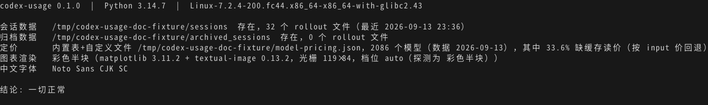
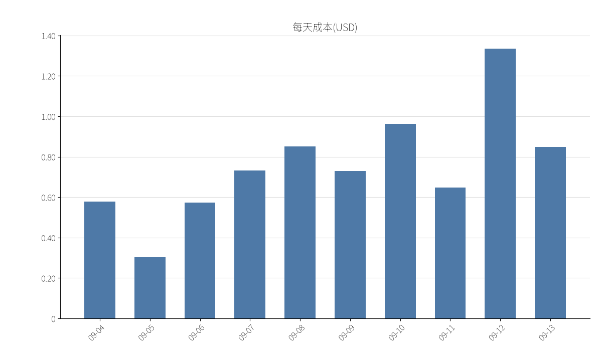
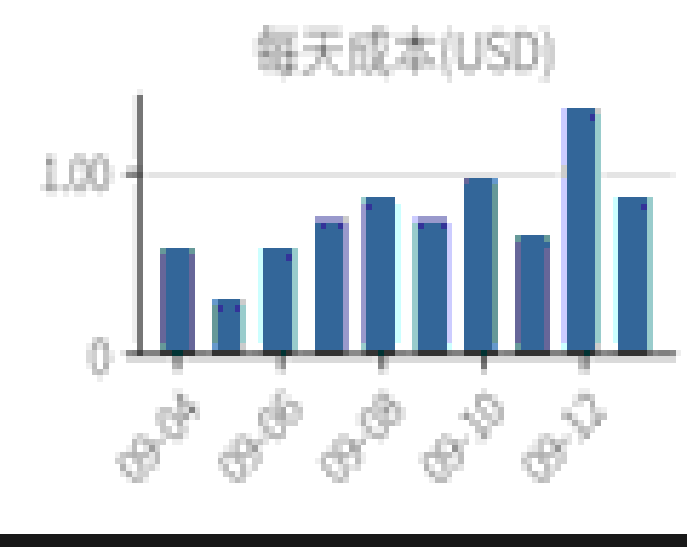
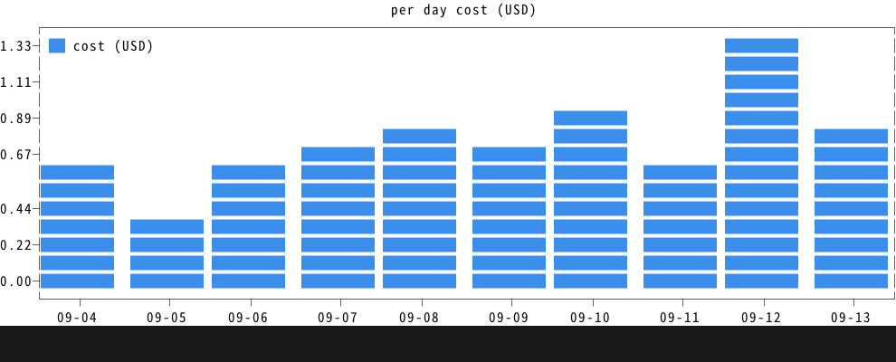
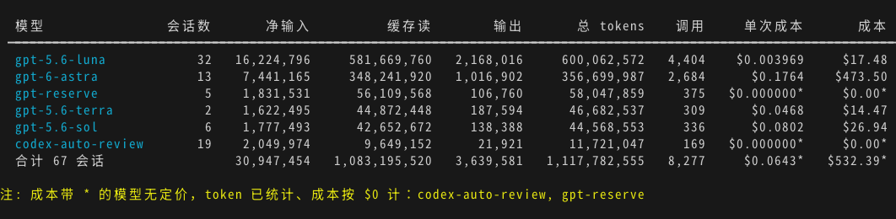
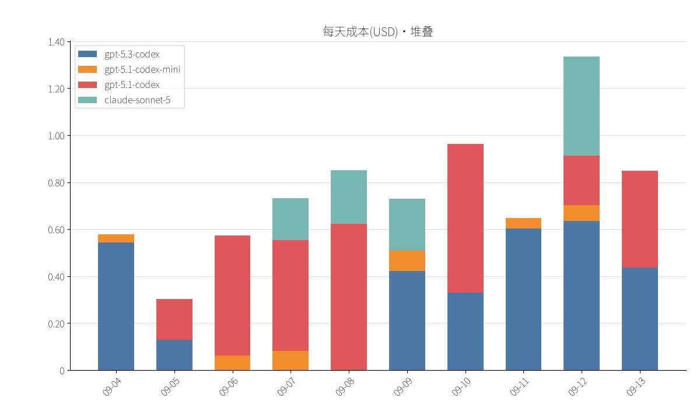
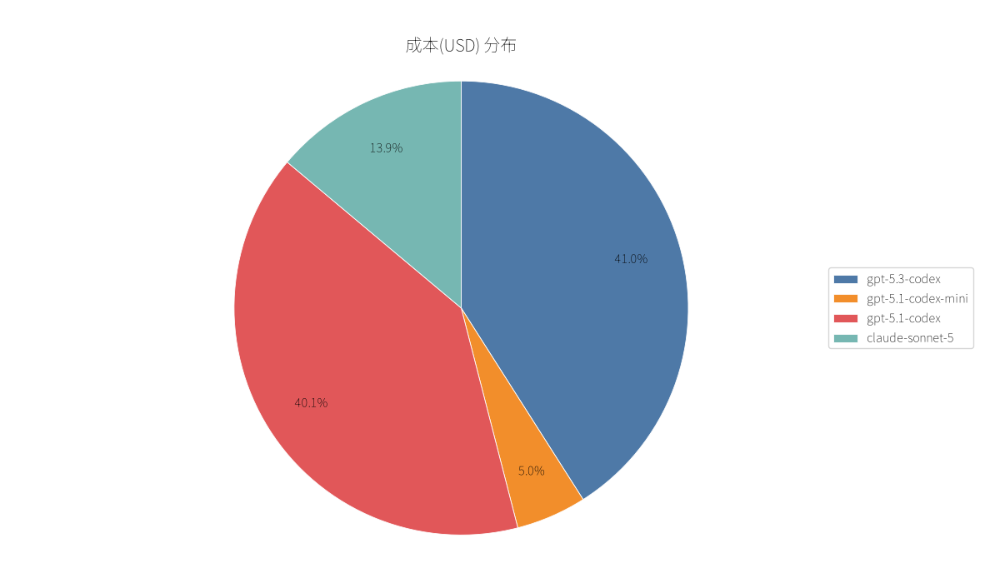
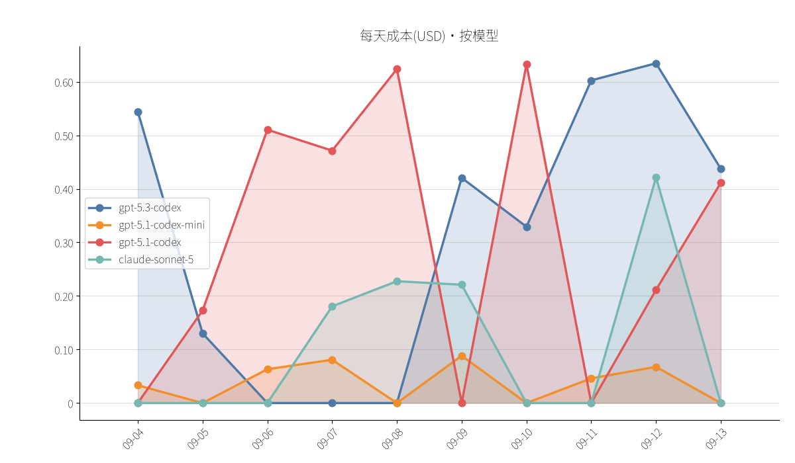

# codex-usage

[](https://github.com/stofancy/codex-usage/actions/workflows/ci.yml)
[](pyproject.toml)
[](LICENSE)

**English** · [中文](README.zh-CN.md)

Local Codex usage statistics: parse the rollout session files under `~/.codex/sessions`, aggregate them by **session / subagent / day / model**, and view the result as terminal tables ([rich](https://github.com/Textualize/rich)) or charts, with per-model cost estimation.

Charts default to **native images**: [matplotlib](https://matplotlib.org/) renders a PNG and [textual-image](https://github.com/lnqs/textual-image) puts it into the terminal. Terminals with a graphics protocol (kitty / Sixel) show the image itself, others show colored half-blocks; this needs the optional image dependencies and a terminal on stdout. Without the extra, when stdout is redirected to a pipe, or with `--ascii`, charts fall back to ASCII art ([plotext](https://github.com/piccolomo/plotext) + [termcharts](https://github.com/zvovcahovo/termcharts)).

Everything runs locally and reads local files only. The single network action is the explicit `codex-usage --update-pricing` refresh; counting and charting never touch the network. Cost is computed from a pricing table merged from three layers — the built-in public price list, a local cache, and your own `CODEX_USAGE_PRICING_FILE` (highest priority) — see [Pricing](#pricing) and [docs/pricing.md](docs/pricing.md). A model with no price still has its tokens counted: its cost is $0 and the row is marked `*`.

> The human-readable CLI output (table headers, chart titles, `--help`, `--doctor`) is currently Chinese; the screenshots below are real output. The machine-readable surface (`--json`, `--schema`, `--doctor --json`) has a language-neutral, documented contract.

## Why codex-usage

Five differences we can point at; the full comparison, the weaknesses and every citation live in [docs/competitors.md](docs/competitors.md).

- **Native images in the terminal.** matplotlib renders the chart and textual-image puts it into the terminal: a graphics-protocol terminal (kitty TGP / Sixel) shows the real image, others get colored half-blocks, and a missing extra, a pipe or `--ascii` falls back to ASCII art — `CODEX_USAGE_IMAGE_MODE` can force any tier. In the eleven projects surveyed, charts live in web/desktop dashboards or PDF reports (anthropometer), and none of their READMEs documents terminal graphics support.
- **Machine-readable self-description.** `--schema` is generated from the argparse definition, so the option list cannot drift from the implementation, and it exposes the `--json` field contract plus the chart-rendering environment; `--doctor` checks the data sources, the pricing layer, image support, the active terminal tier and the CJK font, with `--json` for agents.
- **Subagents and family trees are first-class.** Every rollout file is parsed on its own and subagents are listed by nickname + role; `--family` puts a main thread and its subagents into one tree. Some aggregators derive Codex usage from higher-level state and can permanently defer sessions after a fork ([farion1231/cc-switch#5687](https://github.com/farion1231/cc-switch/issues/5687)).
- **Offline by default.** Counting, aggregating and charting never touch the network, and the built-in price snapshot (2086 models) makes the cost column useful right after install; `--update-pricing` is the only network action and only runs when you ask for it.
- **Accounting you can verify.** Tokens come from the delta of the cumulative `total_token_usage` snapshots, attributed to the model in effect for that turn, with `last_token_usage` as the fallback when a counter resets or is missing — and no double-counting of repeated snapshots or inherited parent history ([Metering](#metering)). On a fixed window (`--since 20260911 --until 20260912`, recomputed 2026-09-13) our per-(day, model) ledger matches ccusage exactly — 1,830,205,933 tokens, difference 0 — and the [remaining cost difference](#reconciliation-with-ccusage) is a Fast-tier add-on ccusage does not apply. The whole suite runs on synthetic fixtures (no local Codex data needed) across a Python 3.10–3.13 CI matrix.

And the honest part: [ccusage](https://github.com/ccusage/ccusage) has 18,520 stars (fetched 2026-09-13), covers 18 CLI tools and installs with `npx`, while codex-usage is a single-source, single-author project. We aim to be the deepest Codex-only view, not another 40-tool dashboard.

## Install

Requires **Python ≥ 3.10**.

```bash
uv tool install codex-usage                                          # tables + ASCII charts
uv tool install "git+https://github.com/stofancy/codex-usage[image]" # + native image charts
```

The optional `[image]` extra pulls in matplotlib and textual-image, and `textual-image` requires **Python ≥ 3.12**; on 3.10/3.11 charts stay in ASCII mode and everything else keeps working. Without the extra, when stdout is not a terminal, or with `--ascii`, charts automatically fall back to ASCII art.

## Usage

```bash
codex-usage                                          # today's sessions (incl. subagents, one row per session)
codex-usage --by-model                               # aggregate by model (one row per model, with session count)
codex-usage --by-day --since 2026-09-04              # aggregate by day
codex-usage --by-day --by-model --since 2026-09-04   # day × model
codex-usage --family --parent 01a083b7 --since 2026-09-09     # family tree: main thread + its subagents
codex-usage --family --by-model --since 2026-09-09            # family × model
codex-usage --raw --type subagent                    # file granularity: one subagent file per row
codex-usage --since "2026-09-11 09:00" --until "2026-09-11 14:00"   # minute-precision window
codex-usage --by-model --since 20260912-161023       # compact time: same as 2026-09-12 16:10:23
codex-usage --by-model --since 20260912-16           # compact time: same as 2026-09-12 16:00
codex-usage --chart pie                              # pie: cost share per model
codex-usage --chart bar --by-day --by-model --metric total   # stacked bars
codex-usage --chart area --by-day --metric cache     # area: daily cache reads
codex-usage --chart bar --by-day --ascii             # force ASCII art (native image is preferred in a terminal)
codex-usage --json                                   # machine-readable output (per-model details included)
codex-usage --help                                   # self-documenting help (/? , -? , help are equivalent)
codex-usage --schema                                 # machine-readable contract (JSON)
codex-usage --doctor                                 # environment self-check (data source / pricing / image support)
codex-usage --update-pricing                         # refresh the local pricing cache (the only network action)
```

### Time formats

`--since` / `--until` accept two forms, and you can mix them:

| Form | Example | Meaning |
|---|---|---|
| Explicit | `2026-09-12`, `2026-09-12 16:10`, `2026-09-12T16:10:23` | conventional format |
| Compact | `20260912`, `20260912-16`, `20260912-1610`, `20260912-161023` | `YYYYMMDD[-HH[MM[SS]]]`; the separator may also be a space, `.` or `T`, and the time part may be written `16:10:23` |

Missing parts are filled with 0 for `--since` (`20260912-16` → 16:00:00) and with the maximum for `--until` (→ 16:59:59; a bare date → 23:59:59).

### Table columns

| Column | Meaning |
|---|---|
| Net input / Cache read / Output | token counts; net input = gross input − cache read |
| Total tokens | net input + cache read + output |
| Calls | number of API calls (`token_count` turns, attributed to the model in effect at that time) |
| Cost/call | cost ÷ calls; `-` when there are no calls |
| Cost | converted with the pricing table; a model with no price counts as $0 and is marked `*` |

### Metering

Token counts are derived from the rollout's cumulative `token_count.total_token_usage` snapshots, not from the per-turn `last_token_usage` values:

- A turn adds the **delta of the cumulative counters** (current snapshot − previous snapshot), attributed to the model that the turn's `turn_context` reported.
- A **repeated snapshot** (no advance) adds nothing, so replayed events are not counted twice.
- The **first snapshot of a file** may be an inherited parent-thread history; only its own `last_token_usage` is counted, so an inherited prefix whose `last` is 0 contributes nothing.
- If the cumulative counters **drop** (context compaction resets them) or a snapshot carries no cumulative value, that turn falls back to `last_token_usage`.
- File admission is not limited to the date directories inside the window: files whose path date is older but whose **mtime is at or after `--since`** are scanned as well, so a long session that keeps writing past midnight is not dropped; turns are then filtered by their event timestamps.

`--json` exposes this for auditing: a per-session `metering` object (`resets`, `fallbacks`, `delta_sum`) and a per-model `tiers` breakdown.

### Semantics

| Kind | Options | Notes |
|---|---|---|
| Aggregation | `--by-day` `--by-model` | row granularity; can be combined into day × model |
| Structure | `--family` `--raw` | family tree / file-granularity entities |
| Filters | `--since` `--until` `--type` `--model` `--session` `--parent` `--archived` | only narrow the range, never change row granularity |
| Charts | `--chart pie\|bar\|area\|line` `--metric cost\|input\|cache\|output\|total` `--ascii` | data comes from the aggregation dimension; `--ascii` forces ASCII art |
| Output | `--json` | session-level JSON Lines with per-model details (including call counts), compatible with the other options |
| Self-description | `--schema` `--doctor` | machine-readable contract / environment self-check, taking precedence over other options |

A model with no pricing entry: tokens are still counted, cost is $0, the row is marked `*`, and the model names are listed below the table.

## Pricing

Token counting is always local; only the cost column needs prices. `codex-usage` ships a **built-in public price snapshot** (from `models.dev`: 2086 priced models at the time of writing), so cost estimation works offline right after install. Three layers are merged by `modelId`, with higher-priority entries overriding lower ones:

| Priority | Source | Role |
|---|---|---|
| Low | built-in table (`src/codex_usage/data/pricing.json`) | baseline coverage of public models |
| Middle | user cache `~/.cache/codex-usage/pricing.json` (`CODEX_USAGE_CACHE_DIR` overrides the directory) | written by `--update-pricing` |
| High | `CODEX_USAGE_PRICING_FILE` (defaults to `~/.cc-switch/model-pricing.json`) | your own/private prices |

A layer that is missing, empty or corrupt is simply skipped; if all three are unusable, tokens are still counted and the cost shows `$0.00*`. The format is cc-switch compatible — `{"models":[{"modelId": …, "inputCostPerMillion": …, "cacheReadCostPerMillion": …, "outputCostPerMillion": …}]}` — so an existing cc-switch table keeps working and only overrides the entries it defines.

Refresh the cache from a public channel (the only network action in the tool, and only when you ask for it):

```bash
codex-usage --update-pricing                         # models.dev (default)
codex-usage --update-pricing --pricing-source litellm
```

Model names found in sessions are matched exactly, then normalized (case, provider prefix, date and `-latest` suffixes, common aliases), then by longest prefix — so `gpt-5.1-codex-2025-11-13` and `openrouter/openai/GPT-5.1-Codex` both resolve to `gpt-5.1-codex`.

Three details shape the resulting numbers:

- **Cache reads without a price.** About a third of the effective table (33.6%) has no `cacheReadCostPerMillion`. For those models, cached reads are charged at the model's **input price** instead of $0 — a deliberate upper bound (real cache-read prices are around 10% of input), so the estimate can over-count but not silently under-count.
- **Service tiers.** Codex records which tier a turn ran under. `priority` and `fast` are the same tier (OpenAI renamed priority processing to Fast) and are priced with the official per-model Fast rates — 2.0× standard for Astra and the 5.6 Sol/Terra/Luna family, 2.5× for `gpt-5.5` — while `flex` is 0.5×. Prices are **API-equivalent USD**, not the ChatGPT subscription credit multipliers (a different rate card). Models without a public Fast price (for example `gpt-5-codex`) stay at the standard price and report `tier_priced: false`.
- **Labels with no public price.** `codex-auto-review` has no price fields in any public source, so it goes through an auditable alias table (`src/codex_usage/data/model_aliases.json`) that maps it to `gpt-5.5` and flags the mapping `assumed: true` (following ccusage's dated fallback table and a three-way token reconciliation). `gpt-reserve` has no public price from any source, so it stays `$0.00*` instead of being guessed. The alias table and the tier price table can be replaced with `CODEX_USAGE_ALIASES_FILE` and `CODEX_USAGE_TIER_PRICING_FILE`.

Caveats: the built-in table is a snapshot (it carries an `updated` timestamp); context-tier prices (`>200k`), cache-write pricing and per-reseller markups are not modelled; a model that no public channel prices stays `$0.00*`. Point `CODEX_USAGE_PRICING_FILE` at your own table if you need exact billing. Sources, field mapping and licenses are documented in [docs/pricing.md](docs/pricing.md).

### Reconciliation with ccusage

Recomputed on 2026-09-13 for the fixed window `--since 20260911 --until 20260912`:

| | codex-usage | ccusage | Difference |
|---|---|---|---|
| Tokens, per (day, model) | 1,830,205,933 | 1,830,205,933 | **0** |
| Cost | $1,116.04 | $1,064.64 | **+$51.40** |

The token ledgers match entry by entry once cross-day files are included (without the backfill described in [Metering](#metering) we were missing 62,780,912 tokens and $66.75 in this window). The cost difference is entirely `gpt-6-astra`'s Fast-tier add-on, which ccusage does not apply to its 292 priority turns; our standard-price total for the same window is $1,061.45, and `ccusage − our standard price = +$3.19` is exactly the Fast add-on for `gpt-5.6-luna` and `codex-auto-review`, which ccusage does apply. 09-11, which has no priority turns, is identical to the cent ($210.75). Method, per-file recomputation and the full ledger: [docs/metering-verification.md](docs/metering-verification.md).

## Self-describing and self-checking (for humans and agents)

The tool explains itself: how to use it, what it can output, and whether the current environment is healthy — no external documentation required.

`codex-usage --help` (`/?`, `-?` and `help` are equivalent) closes with a structured guide: the help entry points, followed by four parts — examples, semantics, output & exit codes, and data sources & environment variables. `codex-usage --schema` is the JSON version of the same contract; its option list is generated directly from the argparse definition, so it cannot drift from the implementation:

```bash
codex-usage --schema | jq '.options[] | select(.flags | index("--chart"))'
codex-usage --schema | jq '.json_output.fields'   # meaning and unit of every --json record field
codex-usage --json --since 20260910 | jq -c '{id:.session_id,total:.total_tokens,calls}' | head -3
```

`codex-usage --doctor` (add `--json` for the structured form) inspects the environment: whether the session and archive directories exist and how many rollout files they hold, which pricing source is in effect, how many models it provides and what share of them lacks a cache-read price, whether image rendering is available and which tier is active, and whether a CJK font is installed. Actionable hints are listed separately, and `ok` says whether everything is fine.



```text
$ codex-usage --doctor
codex-usage 0.1.0  |  Python 3.14.7  |  Linux-...

会话数据   /tmp/codex-usage-doc-fixture/sessions  存在，32 个 rollout 文件（最近 2026-09-13 23:36）
归档数据   /tmp/codex-usage-doc-fixture/archived_sessions  存在，0 个 rollout 文件
定价       内置表+自定义文件 /tmp/codex-usage-doc-fixture/model-pricing.json，2086 个模型（数据 2026-09-13），其中 33.6% 缺缓存读价（按 input 价回退）
图表渲染   彩色半块（matplotlib 3.11.2 + textual-image 0.13.2，光栅 119×84，档位 auto（探测为 彩色半块））
中文字体   Noto Sans CJK SC

结论: 一切正常
```

Convention: data goes to stdout only and messages/errors go to stderr only, so `codex-usage --json … | jq` is never interrupted by noise. Exit codes are `0` success, `1` usage or runtime error, `2` argument parsing error, and `141` when the consumer of the pipe closes early.

## Charts

`--chart` draws from the aggregation dimension: a pie is per model; a bar chart is per day / model / day × model (day × model stacks automatically); area and line charts are daily trends (add `--by-model` for multiple series with a legend). `--chart` does not combine with `--family`, and `--chart pie` does not combine with `--by-day` (a pie is per model). `--json` takes precedence over `--chart`.

Rendering picks one of three tiers from the environment:

| Environment | Rendering |
|---|---|
| Terminal supports a graphics protocol (kitty / Ghostty / WezTerm / Konsole / foot / xterm-sixel, …) and `[image]` is installed | matplotlib renders a PNG and the terminal shows it natively (CJK labels render correctly) |
| No graphics protocol, but `[image]` is installed | the same PNG is converted to colored half-blocks (shapes and colors recognizable, text coarse) |
| `[image]` missing, stdout redirected, or `--ascii` | plotext / termcharts ASCII art |

The image resolution follows the raster size the terminal can display, so thin lines are not washed out by upscaling a PNG tenfold; x-axis labels are thinned out when there are too many, and axis ticks use short forms such as `120K` or `3.4B`.

All three tiers on the same window (`--since 2026-09-04 --until 2026-09-13 --chart bar --by-day`):

| Tier | Result |
|---|---|
| Native image (kitty TGP / Sixel) |  |
| Colored half-blocks (terminal without a graphics protocol) |  |
| ASCII art (`--ascii`, no `[image]`, or redirected stdout) |  |

The native image is matplotlib's original figure with crisp text. Half-blocks squeeze two pixels into one character cell: the shape and the palette survive, the text is coarse. ASCII art is the smallest and the most portable. In the ASCII tier the title and the legend are automatically transliterated to ASCII (plotext lays out 1 column = 1 character, so wide CJK characters would be garbled); the native-image and half-block tiers keep the original labels.

### Forcing a tier

Auto-detection occasionally gets it wrong (for example a terminal claims graphics-protocol support but renders badly), so an environment variable can override it:

```bash
CODEX_USAGE_IMAGE_MODE=halfcell codex-usage --chart bar --by-model   # fall back to colored half-blocks
CODEX_USAGE_IMAGE_MODE=tgp      codex-usage --chart bar --by-model   # force the kitty graphics protocol
CODEX_USAGE_IMAGE_MODE=ascii    codex-usage --chart bar --by-model   # same as --ascii
```

Values are `auto` (default, auto-detect) | `tgp` | `sixel` | `halfcell` | `ascii`; an invalid value is treated as `auto`. Both the active tier and the auto-detected one are reported by `codex-usage --doctor`, and agents can read them from `chart_rendering.env` in `codex-usage --schema`.

Other views (per-model cost table, day × model stacked bars, cost-share pie, daily cost area chart):

| Table (per model) | Stacked bars (day × model) |
|---|---|
|  |  |

| Pie (native image) | Area (native image) |
|---|---|
|  |  |

| Chart | Data | Notes |
|---|---|---|
| `pie` | by model | share of each model (cost by default, change with `--metric`) |
| `bar` | day / model / day × model | day × model stacks automatically |
| `area` / `line` | daily trend | add `--by-model` for multiple series with a legend |

## Development

```bash
uv venv && uv pip install -e ".[image]" pytest   # with native image deps; the image tests skip without them
.venv/bin/python -m pytest tests/ -q             # unit + CLI end-to-end (synthetic fixtures, no local data)
```

Data paths can be overridden with environment variables: `CODEX_USAGE_SESSIONS_DIR`, `CODEX_USAGE_ARCHIVE_DIR`, `CODEX_USAGE_PRICING_FILE`, `CODEX_USAGE_CACHE_DIR`, `CODEX_USAGE_TIER_PRICING_FILE`, `CODEX_USAGE_ALIASES_FILE`.

The screenshots in `docs/shots/` are generated from synthetic fixtures (public model names and public prices) by [`tools/make_doc_shots.py`](tools/make_doc_shots.py); no real session data is involved:

```bash
.venv/bin/python tools/make_doc_shots.py --clean
```

See [CONTRIBUTING.md](CONTRIBUTING.md) for how to contribute and [CHANGELOG.md](CHANGELOG.md) for released changes.

## Known limitations

- Only rollout files produced by the official OpenAI subscription (OAuth) are parsed; usage that goes through third-party gateways never reaches the local session files.
- Time filtering uses each event's timestamp (UTC → local time): a session spanning the window only contributes the turns inside it, and day grouping uses the session's activity start.
- Daily totals can still differ from other tools' day bucketing (codex-usage groups by the session's activity start and filters turns by their event timestamps), but on a fixed window the per-(day, model) token ledger matches ccusage exactly — see [Reconciliation with ccusage](#reconciliation-with-ccusage); the cost difference there comes from Fast-tier handling, not from tokens.
- Native image charts depend on textual-image probing the terminal's graphics support: tmux needs passthrough enabled, and a few terminals don't report their cell pixel size, in which case a default raster is used and the displayed size may differ slightly. Use `--ascii` if you don't want native images.
- The human-readable output is Chinese-only; the JSON contracts are language-neutral.

## License

[MIT](LICENSE)
