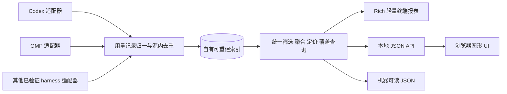

# 跨 harness LLM 用量统计：研究结论与产品方案

日期：2026-09-27。状态：研究完成，CodeBurn 已从源码实际运行对照；产品实现未开始。用户后续否决 Textual 全屏方向，终端改为 ccusage 式轻量输出。本轮替代对照排除全部绘图。

## 1. 结论先行

1. **有成熟同类产品，不能把“多 harness + OMP + UI/TUI”当市场空白。** CodeBurn 最接近整套目标，Tokscale 和 agentsview 分别提供强 TUI 与本地 Web 参考；OMP 自己也有官方 `omp stats` 看板。
2. **不再以终端嵌图或全屏应用为主路线。** 终端参考 ccusage：一次性报表、宽度适配、参数筛选、滚动历史与管道；图形交互交给本地浏览器。不引入 Textual。
3. **两端共用的是计量与查询，不是 UI 布局。** 同一快照、筛选和价格基准必须得到相同数字；网页和终端各用合适的呈现与操作方式。
4. **当前仓库不是换皮即可。** 已运行探针确认跨日分桶错误和原地筛选污染；调用时间与辅助用途等需要保留到统一层，才能长期交互、正确追溯。
5. **CodeBurn 已实测，不能无改造完整替代。** 真实日窗口tokens和calls一致，但家族实体、分钟过滤、档位计价、raw和机器契约等有缺口。继续比较扩展CodeBurn与本项目改造，不假设只补一个OMP parser即可。

## 2. 用户已确认的需求

| 项 | 已定边界 |
|---|---|
| 统计对象 | 从 Codex 专用扩展为多 harness 的 LLM 用量；OMP 是当前明确缺口，不是最终覆盖上限 |
| 数据范围 | 单机本地 |
| 图形界面 | 本地浏览器，不是桌面安装包 |
| 入口优先级 | Web 与终端同等重要；终端明确采用轻量一次性输出，不要求全屏或交互镜像 |
| 体验约束 | 不依赖终端图片协议；解决信息层级、排版、宽窄屏和交互问题 |
| 本轮授权 | 并行研究、拉取运行CodeBurn并对照全部现有非绘图能力；不实施产品改造 |

继续采用当前项目的本地只读原则：不上传日志、不读凭据、不拦截 API、不修改 harness 配置。自有缓存可重建；价格联网更新必须显式触发。

“所有 harness”是扩展目标，不是假装有通用日志格式。实施批次必须列明来源与支持能力，不能静默缩成两个，也不能宣称任何工具都有可恢复的历史精确用量。

## 3. 调研文档

- [竞品、源码边界与采用/扩展/自建比较](2026-09-27-harness-market.md)
- [Web/TUI 信息架构、技术选型、状态与尺寸验收](2026-09-27-harness-interfaces.md)
- [数据接入、OMP 覆盖、实测缺陷与统一计量](2026-09-27-harness-data.md)
- [CodeBurn 固定版本非绘图能力实测](2026-09-27-codeburn-verification.md)
- [ccusage 式轻量终端与 Rich 探针](2026-09-27-lightweight-terminal.md)

旧 [Codex 专用竞品调研](../competitors.md) 保留为历史记录。其中“终端真图是优势”“把 Codex 做深”的定位不作为本方案结论，旧数量/版本也不作为本轮事实。

## 4. 关键事实如何影响决策

| 已取得证据 | 对方案的影响 | 证据等级 |
|---|---|---|
| CodeBurn 有 TUI、本地网页和独立 OMP parser；Tokscale/agentsview 明列 OMP | 必须比较采用或补差，不从零假设没人覆盖 | 本轮官方文档/源码 |
| CodeBurn当前pi.ts跳过非message；合成model_usage追加后总量不变 | 不能把OMP支持名单当成全部辅助调用覆盖 | 源码与真实CLI合成探针 |
| OMP 官方 stats 上游处理 model_usage；本机 stats 库尚未包含本项目抽样的 72 条辅助记录 | 必须区分源日志、投影、版本、新鲜度，不能只读旧库便声称实时完整 | 上游源码 + 本机只读结构/查询 |
| 两天各 100 tokens 被当前 `group_by_day` 合成首日 200 | 统一记录需保留调用发生时间，日期桶不能用会话首日 | 主代理运行合成探针 |
| 同一缓存先筛 model-a，再筛 model-b，第二次返回空 | 长生命周期查询必须无副作用，不复用可变筛选结果 | 主代理运行合成探针 |
| 研究代理运行现有全历史查询约 5.26 秒 | 交互查询不能每次重扫，推荐自有可重建索引 | 单机样本，不是性能保证 |

已构建CodeBurn固定版本并运行真实日期/合成夹具/80列PTY；未运行新的自建Web/TUI。详细实测和限制见CodeBurn报告，不能将部分样例通过扩大成全部能力等价。

## 5. 产品推荐形态

### 5.1 本地浏览器：账本为主，图表辅助

首屏：时间与来源筛选、用量/已知估算费用/缺价提示、紧凑趋势、可切换维度账本、选中项详情。模型、harness、项目、用途都可横切；会话详情里才呈现子代理树与家族时间线。

三个研究方向的取舍：

- **账本 + 趋势：推荐。** 高频问题是“哪里用了多少、是否可信”，响应式与数值对齐容易控制。
- **时间线优先：不作首页。** 上千会话不可读，保留为单家族详情。
- **追溯树优先：不作首页。** 跨模型分析不自然，保留为会话下钻。

风格建议：克制的分析工作台，少装饰、数字清楚、颜色服务语义。尚未做高保真视觉定稿，不能用框架名承诺审美。

### 5.2 终端：轻量报表，不做全屏应用

默认打印一次并退出，保留历史；输出前探测宽度，宽屏显示更多列，窄屏减少次要列或转纵向字段。核心名称与数字可读，完整指标通过详情参数或JSON获取，不默认接管键盘或启动分页器。

每次调用适配当前宽度，不承诺进程退出后动态重排历史。NO_COLOR关闭颜色不保证零ANSI，严格纯文本另行控制；管道和JSON无UI控制序列。watch不是当前默认需求。

Web与终端共享筛选、数值和覆盖语义，但网页联动操作与终端参数不需要一一镜像。轻量终端不是Web启动器，也不是缩水为只有总额。

## 6. 如果选择继续改造本项目

### 推荐技术组合

- Python 保留可验证的 Codex 计量知识，拆开源特定算法与通用记录。
- SQLite 作为共享索引，源文件只读；同步与查询分离，查询结果带快照标识。
- 终端保留 Rich，重做列预算与紧凑布局；撤回 Textual/全屏状态机，不为美观切 Rust/Go。
- Web 选 TypeScript/React 构建成静态资源随包发行；运行时无 Node/CDN 依赖。
- HTTP 选小型 ASGI 应用，避免自行扩展 `http.server` 成安全框架。
- 图表初始采用一个成熟浏览器图表库，列表服务端分页；性能验证后再引虚拟化。

具体 ASGI/图表版本是实施级选择，需要依赖与探针确认，不冒充已经冻结的施工计划。当前推荐足够判断架构与维护边界，不意味着自动授权换整个技术栈。

### 数据决定

- 以用量事件而非会话汇总为底层；source 粒度只有汇总时明确标注。
- harness、provider、model 分离；保留原始身份和用途。
- 缓存读/写、推理/其他分量按来源语义处理；不套统一错误加法。
- 金额性质和完整性分开，未知不是零；前端只格式化，不重算。
- OMP 推荐提取原始 usage 记录，而非依赖可能过期的外部 stats 库；官方库用于对账或经验证的可选输入，不能双算。
- 调用、会话、家族三种总量边界清楚；来源不支持父子归属时显示未知，不造树。

### 退出与恢复

索引失败保留旧快照并标过期；格式变化按来源重建；追加半行不入账；重扫不能翻倍。Web前台进程显式退出，终端命令输出后退出且不改终端模式。后台daemon、多机锁服务和通用事件总线不在设计范围。

## 7. 实施前的决策门

这不是现在开始写代码的任务清单，而是把研究转为可实施方案的顺序：

1. **现成产品验收门已取得结果**：CodeBurn真实窗口总tokens/calls一致，但非绘图能力不完整；见实测矩阵。不能直接切换，也不因某一个缺口就决定重写。
2. **确定采用路线**：若有限补丁即可满足，优先采用/贡献/维护小 fork；若两端交互和计量模型都不合适，再选择本项目改造。不把某一个 parser 缺口当全盘重写理由。
3. **冻结首批来源清单**：Codex、OMP 已明确；其他实际使用的 harness 需逐一列名和能力。此清单尚未由用户确认，不擅自缩小“所有 harness”的目标。
4. **视觉与输出定稿**：若自建，产出Web真实布局样稿及轻量终端宽/中/窄输出样例，使用同一脱敏数据。终端不建设全屏原型。
5. **制定可执行改造计划**：冻结查询契约、计量语义、数据来源、命令切换、缓存与恢复；将工作拆成可验证的责任单元。

### 自建情况下的责任单元草案

| 单元 | 内容 | 验收/恢复 |
|---|---|---|
| 用量契约与数据核心 | Codex 迁移、OMP 接入、覆盖能力、去重、日期桶、费用性质 | 合成边界与真实脱敏窗口复算；源数据不写；自有索引可删重建 |
| 共享查询与索引 | 纯查询、快照、分页、索引刷新 | 相同查询幂等、重扫不倍增、单源失败明确；旧快照可读 |
| Web | 账本、趋势、详情、覆盖、响应式与本地安全 | 真实浏览器三档尺寸及完整操作，无外网请求 |
| 轻量终端 | 响应式报表、参数筛选、详情、JSON、纯文本管道 | 真实PTY与120/80/60/40列、CJK、无色、不清屏、输出后退出 |
| 双端收敛与切换 | 共享数据对等、CLI JSON 契约、旧图片路径退役、文档/发布 | 同快照数值完全一致；清晰迁移说明；不长期保留两套旧新计量 |

Web和轻量终端可在共享契约冻结后并行建设，都必须达到各自验收；不强求交互镜像，也不将任一入口降为以后再补。首批来源与发布范围仍需用户确认。

## 8. 验收总表

| 主题 | 必须可观察到的结果 |
|---|---|
| 覆盖 | 每个来源说明读到什么、漏什么、何时扫描，失败和无记录不同 |
| 计量 | 跨日、缓存、模型切换、继承、重复、辅助调用都可复算 |
| 金额 | 已知估算小计与未知覆盖明确；没有账单就不显示假实际成本 |
| 两端 | 相同快照/筛选/时区/价格得到相同记录与总量 |
| Web | 1280+、1024、768、320px 可完成核心操作，键盘与缩放可用 |
| 终端 | 120/80/60/40列一次性输出；不依赖图片、中文与数字可读、不进入备用屏幕 |
| 性能 | 已索引常用筛选目标 P95≤200ms；首次扫描可见进度/可取消，不阻塞交互 |
| 隐私 | 默认离线、无遥测、无凭据读取、无聊天正文导出、源只读 |
| 本地服务 | loopback、Host/Origin 校验、认证引导、GET 无副作用、退出关闭端口 |
| 批处理 | 非TTY不泄漏控制序列，JSON语义明确，默认命令直接输出并退出 |

性能数字是建议目标，不是本轮测试结论。跨终端兼容必须实际验证，不由框架文档自动保证。

## 9. 仍需产品决策的事项

- **扩展CodeBurn还是维护独立产品**：已证实不能直接完整替换。用户未授权放弃现有非绘图能力，后续应比较具体补差成本，而不是继续停留在是否有类似产品。
- **首批除 Codex/OMP 外的命名来源清单**：关系到交付范围，不能由“所有”推导任意数量承诺。
- **视觉方向最终确认与产品命名**：文字方案不能代替真实原型；名称和命令迁移随实施计划一并确认，不先建兼容别名。

其他常规实现决策应由实现团队依据资料和探针自行收敛，不把每个框架选项都抛给用户。

## 10. 本轮执行与证据边界

第一轮四线研究与第二轮三线实测均已交付：竞品、图形UI、终端、数据，以及轻量输出/命令能力/计量对照；主代理负责整合。

实际执行：本机工具帮助/版本、只读数据库与日志结构检查、核心合成探针；CodeBurn源码安装和CLI构建、真实固定日按模型对账、完整sessions核对、合成过滤/家族/档位/归档/OMP检查、80列PTY、Rich宽窄布局与管道探针。

没有执行：产品实现/修复、CodeBurn Web构建运行、全量历史审计、完整测试套件、源库同步、push/开PR。完整证据与未验证项见两份新增报告。

记录两类未成功入口以防混淆：前序系统 Python 无法直接 `python -m codex_usage`（没有 `__main__`），改用 cli 模块又缺 `rich`；已安装 `codex-usage --doctor --json` 成功。研究代理有可用项目虚拟环境运行现有 CLI，两者不是同一个 Python 环境。

本轮只新增研究文档并标注旧研究的历史地位，README/产品说明不提前改成尚未实现的多源双端能力。
